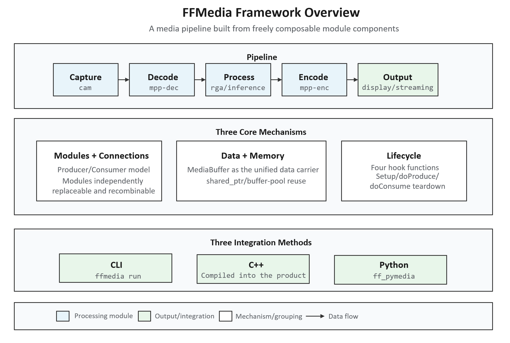
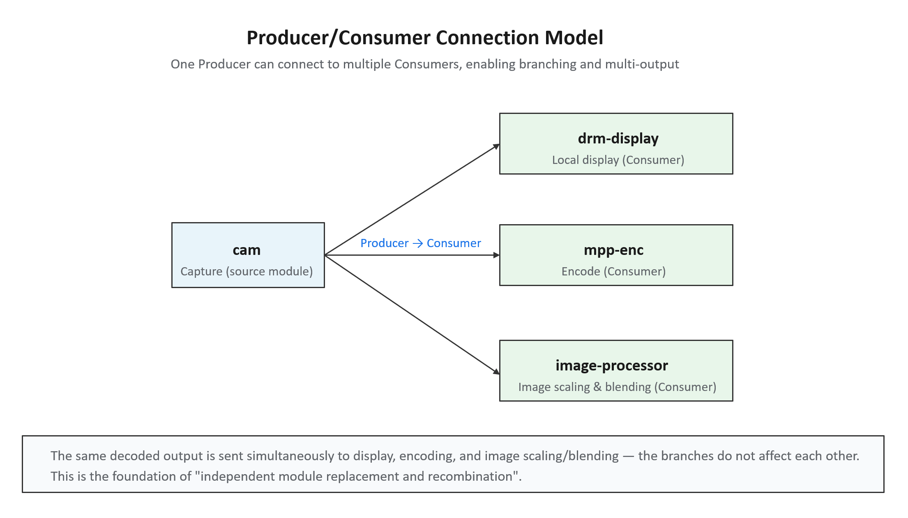
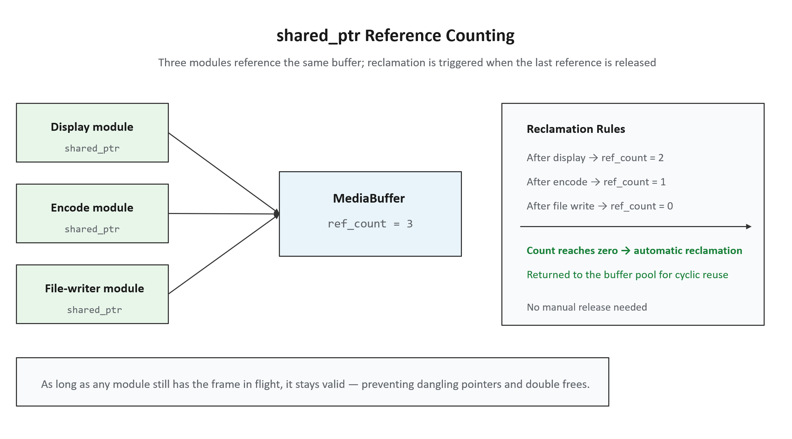
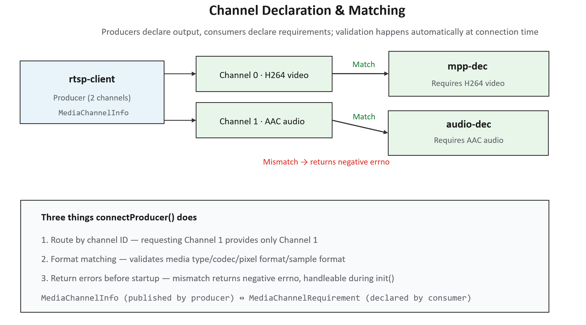
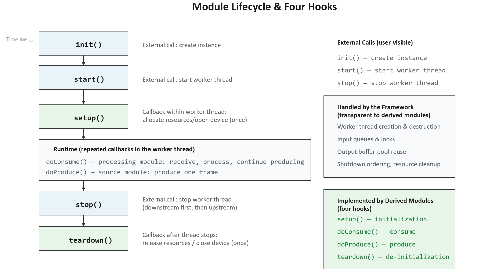
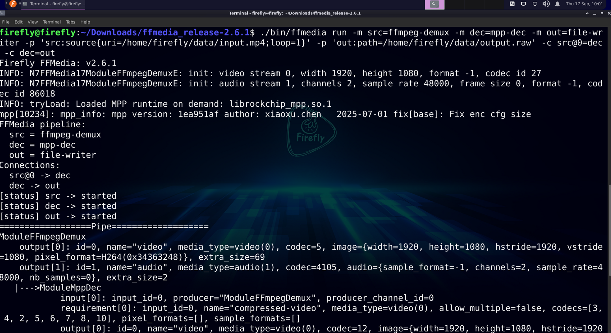
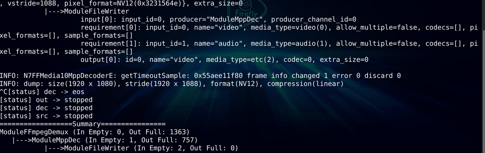

# FFMedia — High-Performance Full-Process Video Processing Framework

## What is FFMedia?

FFMedia is a **modular audio/video processing framework** for multimedia applications on RK Linux.

It is deeply adapted to the hardware capabilities of Rockchip platforms:

- **MPP** — hardware video codec
- **RGA** — 2D image acceleration (scaling, cropping, rotation, format conversion)
- **DRM/KMS** — display output
- **EGL/GLES** — graphics rendering
- **RKNN** — NPU neural network inference

It covers every stage of a complete media pipeline: **capture, reading, decoding, image processing, inference, encoding, display, muxing, and network output**.



---

## What Problems Does It Solve?

The truly complex parts of a multimedia application are usually not "calling a decode API once," but the following four categories of problems. FFMedia is designed precisely to solve these four.

### Pipeline Coupling, High Cost of Modification

In a traditional implementation, capture, decoding, processing, encoding, and so on are often written into the same body of business code. Replacing any single stage (for example, replacing RTSP streaming with RTMP) usually requires modifying the entire flow.

FFMedia encapsulates these capabilities as independent `ModuleMedia` modules, connected via **Producer/Consumer**. Input, processing, and output can be **independently replaced and recombined** — replacing one stage only requires replacing the corresponding module object.

### Multi-Stream Formats Are Easy to Wire Up Wrong

When multiple video/audio streams or different encoding formats exist at the same time, relying on manual conventions to determine connections easily leads to wiring errors.

In FFMedia, the **producer** declares its output via `MediaChannelInfo`, the **consumer** declares its input requirements via `MediaChannelRequirement`, and `connectProducer()` automatically performs channel selection and format matching, returning an error **before startup** rather than exposing the problem at runtime.

### Threads, Buffers, and Resource Cleanup Rewritten Over and Over

Different projects repeatedly implement worker threads, input queues, output buffer pools, shutdown ordering, resource cleanup, and similar logic, which both bloats the code and introduces concurrency risks.

`ModuleMedia` manages all of these foundational mechanisms uniformly; derived modules only need to implement four hooks: `setup()`, `doProduce()`, `doConsume()`, and `teardown()`.

### Hard Platform Integration, Hard Troubleshooting

Applications need to integrate separately with cameras, hardware codecs, RGA, display, and network output, and when something goes wrong they must determine whether the issue lies in "queuing," "processing," or "timestamps."

FFMedia provides the corresponding platform modules, along with debugging capabilities such as `--trace`, `--trace-latency`, `--trace-local-latency`, `dumpPipe()`, and `dumpPipeSummary()`.

---

## Core Concepts

### The Producer/Consumer Model

All modules are uniformly based on `ModuleMedia`. Source modules produce data via `doProduce()`; processing modules consume data via `doConsume()` and may continue to produce output; output modules handle display, file writing, or network transmission.

**A Producer can connect to multiple Consumers**, enabling branching, multi-output, multi-input processing pipelines.



The same decoder output can simultaneously be sent to display and to encoding/streaming, with the two branches not affecting each other.

### Unified MediaBuffer and Smart Pointers

Modules pass data between each other via `std::shared_ptr<MediaBuffer>`. `MediaBuffer` uniformly carries the payload, PTS/DTS, media type, codec format, image or audio parameters, channel ID, and additional data.

**Why use `shared_ptr`:** a buffer may be referenced simultaneously by multiple modules such as display, encoding, and file writing. Who is responsible for releasing it, and when it is safe to release, are error-prone questions with raw pointers (dangling pointers, double frees, memory leaks).

`std::shared_ptr` solves this via **reference counting**: each module holds a shared_ptr pointing to the same buffer, so the reference count is 3; when each module finishes using it and destroys its pointer, the count decreases by 1; **memory is only reclaimed automatically when the last reference is released**.



In other words, "in-flight frames are kept alive by shared pointers" — as long as any module is still using the frame, it will not be reclaimed.

**Buffer pool:** output buffers use a **fixed pool with cyclic reuse** to avoid the overhead of frequent `new`/`delete` (especially important for real-time systems). shared_ptr works together with this: while an in-flight buffer's count is non-zero, it will not be returned to the pool; only when the count reaches zero is it allowed back into the pool for reuse.

### Channel Declaration and Connection Matching

Producers publish `MediaChannelInfo`, consumers declare `MediaChannelRequirement`, and `connectProducer()` does three things:

1. **Route by channel ID** — requesting Channel 1 means only Channel 1 is provided;
2. **Format matching** — validates media type, codec, pixel format, and sample format;
3. **Return errors before startup** — on mismatch, it returns a negative errno that can be handled during the `init()` phase.

For example, an `rtsp-client` simultaneously outputs video (Channel 0, H264) and audio (Channel 1, AAC); the downstream video decoder and audio decoder each take what they need:



### Module Lifecycle: Four Hooks

`ModuleMedia` centralizes threads, queues, buffer pools, shutdown ordering, and resource cleanup in the base class; derived modules only need to implement four hooks:

| Hook | When Called | Responsibility |
| --- | --- | --- |
| `setup()` | Once, before startup | Allocate resources, open devices, parse parameters |
| `doConsume()` | Repeatedly, at runtime | Processing modules: receive a frame, process it, continue producing |
| `doProduce()` | Repeatedly, at runtime | Source modules: produce a frame (e.g., capture) |
| `teardown()` | Once, after stopping | Release resources, close devices |

Full lifecycle: **init() → start() → setup() → [doConsume/doProduce called repeatedly at runtime] → stop() → teardown()**.



Among these, `init()`, `start()`, and `stop()` are called directly by business code; `setup()`, `doConsume()`, `doProduce()`, and `teardown()` are implemented by derived modules and invoked by the framework on the correct worker thread.

**Shutdown ordering:** the framework guarantees the correct "downstream first, then upstream" shutdown order. If capture (upstream) is stopped before the decoder (downstream), the decoder may still be processing a buffer whose pool has already been reclaimed by upstream, causing concurrency errors. This is one of the most common and hardest-to-diagnose classes of bugs in hand-written multithreaded implementations, and the framework eliminates it uniformly.

---

## Module Categories

FFMedia divides modules into three categories corresponding to their role in the pipeline. The following category codes appear in the output of the `ffmedia modules` command:

| Category Code | Full Name | Meaning | Position in the Pipeline |
| --- | --- | --- | --- |
| **vi** | video/audio input | Input | Pipeline source (capture/reading) |
| **vp** | video/audio process | Processing | Pipeline middle (decoding/processing/inference) |
| **vo** | video/audio output | Output | Pipeline end (display/writing/sending) |

**Modules actually provided by the SDK (v2.6.1):**

| Category | Modules | Purpose |
| --- | --- | --- |
| Input (vi) | cam, file-reader, rtsp-client, rtmp-client, ffmpeg-demux, alsa-capture, mem-reader | Camera, file, network stream, FFmpeg demuxing, audio capture, application-fed memory |
| Processing (vp) | mpp-dec, mpp-enc, rga, image-processor, video-stack, inference, aac-dec, aac-enc | Hardware codec, image processing, multi-stream compositing, RKNN inference, audio codec |
| Output (vo) | drm-display, file-writer, rtsp-server, rtmp-server, gb28181-client, ffmpeg-mux, renderer-video, alsa-playback | Display, file writing, streaming, muxing, window rendering, audio playback |

## Integration Methods

FFMedia offers three integration methods, suited to different stages:

| Method | Positioning | Typical Scenarios |
| --- | --- | --- |
| **CLI** | Quick validation via command line | Environment validation, module validation |
| **C++** | Compiled into the product, deep integration | Production deployment |
| **Python** | Script orchestration, rapid prototyping | Early prototypes, automated testing |

### CLI

```bash
ffmedia modules   # List available modules
ffmedia params    # Show module parameters
ffmedia run       # Run a pipeline
```

Can be combined with `--trace`, `--trace-latency`, and `--trace-local-latency` to observe the pipeline.

### C++

Inherit from `ModuleMedia` to implement business modules, connect them via `connectProducer()`, and control the lifecycle with `init()` → `start()` → `stop()`.

### Python

Use the `ff_pymedia` wheel package whose **ABI matches** the target Python for pipeline orchestration.

- **wheel**: Python's installation package format (e.g., `.whl`);
- **ABI**: the binary interface, bound to the Python version and platform (e.g., Python 3.10 and 3.12 are incompatible; ARM and x86 are incompatible), so you must install a package matching the target platform;
- "Available modules are subject to what the release package actually exports" is a boundary statement: the Python bindings do not necessarily expose all of the C++ modules.

### Obtaining the FFMedia SDK

The FFMedia SDK is released under the package name `ffmedia_release`, with source code and prebuilt artifacts hosted on GitHub. There are two ways to obtain the SDK.

**Method 1: Get the latest version (source repository)**

```bash
git clone https://github.com/Firefly-rk-linux-utils/ffmedia_release.git
```

This gives you the latest source code currently in the repository, suitable for those who want the newest features or need to compile and customize it themselves.

**Method 2: Download a specific Release package**

Visit the releases page and download the version you need:

```bash
https://github.com/Firefly-rk-linux-utils/ffmedia_release/releases
```

### SDK Directory Structure

The top-level structure of the SDK release package looks roughly like this (using a particular version of `ffmedia_release` as an example):

```bash
ffmedia_release/
├── bin/            # Command-line tools
│   └── ffmedia     # CLI executable
├── include/
│   └── ffmedia/    # C++ headers
├── lib/
│   └── aarch64-linux-gnu/   # Prebuilt libraries (ARM64 architecture)
├── python/         # Python bindings
│   ├── ff_pymedia-2.6.1-cp310-cp310-linux_aarch64.whl   # Python 3.10
│   └── ff_pymedia-2.6.1-cp311-cp311-linux_aarch64.whl   # Python 3.11
├── docs/           # Documentation
│   ├── ffmedia_api.md      # API reference (channel matching, MediaBuffer, trace)
│   ├── module_media.md     # Module development (lifecycle, buffer pool)
│   └── img/                # Documentation images
├── examples/       # Example code
│   ├── demo/               # Basic examples
│   ├── external_module/    # Custom external module examples
│   ├── inference/          # RKNN inference examples
│   └── tests/              # Test cases
├── build/          # Build artifacts (including compiled examples like demo_simple, demo_video_stack)
├── CMakeLists.txt  # CMake build entry point
├── README.md       # Overview
├── ABI_POLICY.md   # ABI compatibility policy
├── SDK_MANIFEST.txt   # SDK file manifest
├── SDK_SYMLINKS.txt   # Symlink notes
└── SHA256SUMS      # File checksums (integrity verification)
```

**Python wheel naming explained:**

```bash
ff_pymedia-2.6.1-cp310-cp310-linux_aarch64.whl
   │          │      │      │        └── Platform: ARM64 Linux
   │          │      │      └────────── Python ABI version (cp310 = CPython 3.10)
   │          │      └──────────────── Python version (cp310 = Python 3.10)
   │          └──────────────────────── Package version (2.6.1)
   └─────────────────────────────────── Package name
```

### Building the SDK

After obtaining the SDK from source, you can build it with CMake. The build process uses several switches to control whether specific components are compiled.

**Build switches:**

| Switch | Purpose | Default |
| --- | --- | --- |
| `DEMO_OPENCV` | Build the OpenCV demo | Off |
| `ENABLE_TESTS` | Build tests | On |
| `ENABLE_INFERENCE_EXAMPLES` | Build `examples/inference_examples/` | Off |
| `ENABLE_INFERENCE_EXTENSION` | Build the standalone SDK-dependent inference extension in `examples/inference/` | Off |

**Example 1: Build basic demos and tests**

```bash
cmake -S . -B build \
  -DDEMO_OPENCV=OFF \
  -DENABLE_TESTS=ON \
  -DENABLE_INFERENCE_EXAMPLES=OFF
cmake --build build -j
```

**Example 2: Also build inference examples**

```bash
cmake -S . -B build \
  -DENABLE_INFERENCE_EXAMPLES=ON
cmake --build build -j
```

**Example 3: Build the standalone inference extension from the release package root**

```bash
cmake -S . -B build \
  -DENABLE_TESTS=OFF \
  -DENABLE_INFERENCE_EXTENSION=ON
cmake --build build -j
```

> **Note:** The inference extension can also be built on its own — simply enter the `examples/inference/` directory and run `cmake -S . -B build`; that directory automatically discovers the FFMedia CMake configuration of the current release package.

### Listing Actually Available Modules with ffmedia modules

Running `ffmedia modules` lists all modules compiled into the current SDK. Below is real output from a Firefly device (v2.6.1):

```bash
$ ./ffmedia modules
Firefly FFMedia: v2.6.1
TYPE                CLASS GRAPH     DESCRIPTION
cam                 vi    yes       V4L2 camera source
file-reader         vi    yes       File/container source
rtsp-client         vi    yes       RTSP source
rtmp-client         vi    yes       RTMP source or publisher selected by source/publish
mem-reader          vi    special   Application-fed memory source
video-stack         vp    yes       Composite processor with configured input layouts
ffmpeg-demux        vi    yes       FFmpeg input source
alsa-capture        vi    yes       ALSA capture source
mpp-dec             vp    yes       Rockchip MPP decoder
mpp-enc             vp    yes       Rockchip MPP encoder
rga                 vp    yes       Rockchip RGA processor
image-processor     vp    yes       EGL/OpenGL image processor
inference           vp    yes       RKNN inference processor
aac-dec             vp    yes       FDK-AAC decoder
aac-enc             vp    yes       FDK-AAC encoder
drm-display         vo    yes       DRM display sink
file-writer         vo    yes       File output sink
rtsp-server         vo    yes       RTSP server sink
rtmp-server         vo    yes       RTMP server sink
gb28181-client      vo    yes       GB28181 client sink
ffmpeg-mux          vo    yes       FFmpeg output muxer
renderer-video      vo    yes       Window video renderer
alsa-playback       vo    yes       ALSA playback sink
```

**Output field descriptions:**

| Column | Meaning |
| --- | --- |
| TYPE | Module name, i.e., the name used in the CLI and in code |
| CLASS | Category: vi (input), vp (processing), vo (output) |
| GRAPH | Whether it goes through the standard pipeline graph. `yes` = regular module; `special` = special module (does not use standard Producer/Consumer connections) |
| DESCRIPTION | Brief description of the module |

**Notes:**

1. **Modules with `GRAPH = special`** (such as `mem-reader` in the table above) do not go through the standard pipeline graph; they are "data actively provided by the application" special sources. Their integration method differs from regular modules, so consult the corresponding documentation when using them.
2. **The actual number of modules exceeds the summary table in Section 4** — this list also includes `rtmp-client`, `alsa-capture`/`alsa-playback` (audio capture/playback), `aac-dec`/`aac-enc` (audio codec), `renderer-video` (window rendering), `mem-reader` (memory source), and more. Always defer to the actual output of your environment rather than memorizing the list mechanically.
3. **Confirms that "hardware paths are not automatically enabled"** — if a device was not built with a certain module (for example, when RKNN is not configured, the `inference` module may be absent), this list will honestly reflect that rather than over-reporting.

### Inspecting Module Parameters with ffmedia params

Every module has a **queryable, configurable parameter table**. With `ffmedia params TYPE` you can see what parameters a module has, their types, default values, and allowed ranges.

```bash
$ ./ffmedia params            # No arguments; shows usage
Usage: ./ffmedia params TYPE [PATH]

$ ./ffmedia params cam        # Show parameters of the cam module (excerpt)
Parameters for cam:
  status [integer, r, runtime, apply=immediate] default=created current=created min=0 max=4
    enum: created=0 started=1 eos=2 stopped=3 abnormal=4
    Current module status
  buffer-count [integer, rw, apply=immediate, states=any] default=0 current=4 min=0 max=65535 unit=buffers
    Number of buffers in the output pool
  device [string, rw, apply=reconfigure, states=any] default= current=
    V4L2 camera device path
  frame-rate [double, rw, apply=reconfigure, states=any] default=0 current=0 min=0 max=1000 unit=fps
    Requested camera frame rate; zero keeps the device default
  capture/width  [integer, rw, apply=reconfigure, states=any] ...   # Sub-parameter (see below)
```

**Parameter metadata format** (each parameter line carries these fields):

| Field | Meaning | Example |
| --- | --- | --- |
| Parameter name | Supports hierarchy; `/` denotes a sub-parameter | `capture/width` |
| Type | Data type | `integer` / `string` / `double` / `object` |
| Read/write permission | `r` read-only, `rw` readable and writable | `status` is `r` |
| When it takes effect | `apply=immediate` takes effect immediately / `apply=reconfigure` requires reconfiguration | `device` is `reconfigure` |
| State constraint | Which runtime states allow modification | `states=any`, `runtime` |
| Default / current value | Factory default vs. current actual value | `default=0 current=4` |
| Value range | Upper and lower bounds | `min=0 max=65535` |
| Unit | `unit=buffers` / `bytes` / `fps` / `ms` | |
| Enum | Discrete values (optional) | `enum: linear=0 afbc-16x16=1` |
| Description | Textual explanation on the last line | |

**Notes:**

1. **Composite parameters (object)**: parameters such as `capture` are of type `object` and have multiple sub-parameters mounted beneath them (`capture/width`, `capture/height`, `capture/format`, etc.). Run `ffmedia params cam capture` to view that group of sub-parameters on its own.

2. **`apply=reconfigure` vs. `apply=immediate`**:
   - `immediate`: takes effect immediately after modification (e.g., a timeout used at runtime);
   - `reconfigure`: requires the module to be **reconfigured/rebuilt** after modification before it takes effect (e.g., the `device` path and `capture` format — properties determined only when the module is created).

3. **`states=any` / `runtime`**: some parameters can only be modified in specific states. The `status` parameter is marked `r` (read-only) + `runtime`, indicating it is the module's **current state** (created / started / eos / stopped / abnormal), maintained by the framework — applications can only read it, not modify it.

4. **The `atomic` marker**: indicates that multiple sub-items of this parameter must be set **atomically** together; you cannot modify only part of them.

### Running a Pipeline End-to-End with ffmedia run

A single complete command ties together the core concepts described above. The goal: read an MP4 file → hardware decode → output an elementary stream.

```bash
./ffmedia run \
  -m src=ffmpeg-demux -m dec=mpp-dec -m out=file-writer \
  -p 'src:source{uri=/home/firefly/data/input.mp4;loop=1}' \
  -p 'out:path=/home/firefly/data/output.raw' \
  -c src@0=dec -c dec=out
```

**Command syntax breakdown:**

| Option | Purpose | Example |
| --- | --- | --- |
| `-m name=type` | Define a module instance: specify name and type | `src=ffmpeg-demux` |
| `-p 'name:param{...}'` | Set module parameters | `src:source{uri=...;loop=1}` |
| `-c from@ch=to` | Define a connection: a given channel of one module → target module | `src@0=dec` |

This command defines **three modules** (src/dec/out), **two parameter settings** (source file path and output path), and **two connections** (`src@0 → dec`, `dec → out`). The `-p` syntax is: the parameter name after the colon, sub-parameters inside curly braces, with multiple items separated by semicolons.

**Interpreting the output — mapping to three core concepts:**





The first is **lifecycle states**:

```bash
[status] src -> started
[status] dec -> started
[status] out -> started
```

The three modules each move from created to started in turn — the practical manifestation of `init() → setup() → start()`.

The second is **channel matching**: in the pipeline graph printed by `dumpPipe()`, you can see each connection's "producer declaration + consumer requirement":

```bash
|--->ModuleMppDec
input[0]: input_id=0, producer="ModuleFFmpegDemux", producer_channel_id=0
requirement[0]: name="compressed-video", media_type=video(0),
                codecs=[3, 4, 2, 5, 6, 7, 8, 10], ...
```

- `producer_channel_id=0` indicates it connects to the upstream's channel 0 (the video stream);
- `requirement[0]` is the full content of a `MediaChannelRequirement`: name, media type, **codecs whitelist** (acceptable codec formats), and pixel format whitelist;
- The upstream `src` outputs `codec=5` (H264), which falls within `dec`'s `codecs=[...5...]` whitelist, so the **match succeeds**.

The third is **data flow via the unified MediaBuffer**: data is "transformed" step by step across the three modules:

```bash
src  output[0]: codec=5(H264 compressed stream), image={width=1080, height=1920, pixel_format=H264}
dec  output[0]: codec=12(raw pixels),  image={width=1080, height=1920, pixel_format=NV12, hstride=1088}
out  output[0]: media_type=etc(2)
```

Before decoding it is an H264 compressed stream; after decoding it becomes NV12 raw pixels (where `hstride` changes from 1080 to 1088 due to hardware alignment), and finally it is written out. The MediaBuffer at each stage carries the complete media description.

**Connection overview** (corresponding to the `-c` options in the command):

```bash
src@0 -> dec      # src's channel 0 (video) feeds into dec
dec -> out        # dec's default output feeds into out
```

Finally, the `==================Pipe===================` section in the `ffmedia run` output is a complete snapshot from `dumpPipe()`; the trailing `dump: size(...) stride(...) format(NV12) ...` is the summary from `dumpPipeSummary()`.
