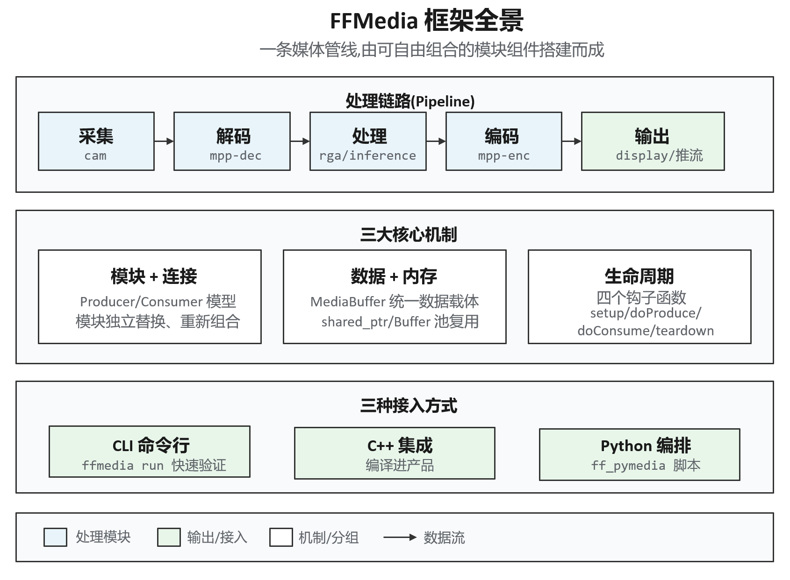
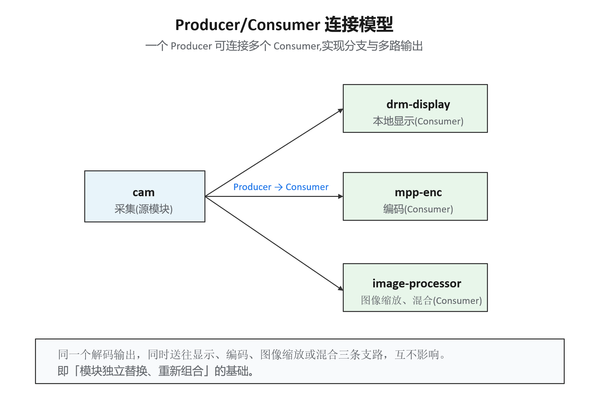
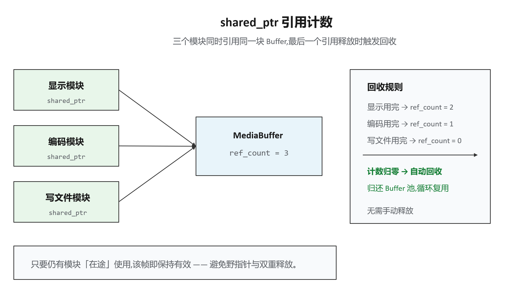
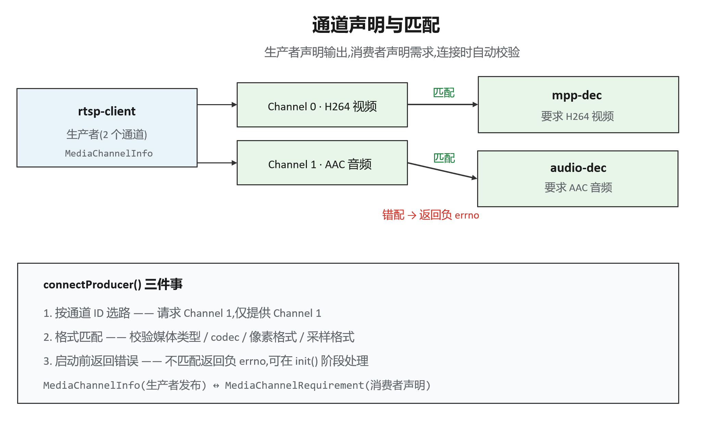
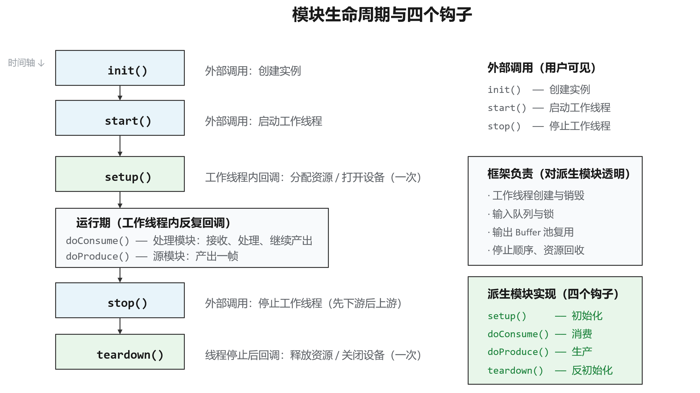

# FFMedia——高性能全流程视频处理框架

## FFMedia 是什么？

FFMedia 是一个面向 RK Linux 多媒体应用的**模块化音视频处理框架**。

它深度适配了 Rockchip 平台的硬件能力：

- **MPP** —— 硬件视频编解码
- **RGA** —— 2D 图像加速(缩放、裁剪、旋转、格式转换)
- **DRM/KMS** —— 显示输出
- **EGL/GLES** —— 图形渲染
- **RKNN** —— NPU 神经网络推理

它覆盖了一条完整媒体链路上的所有环节：**采集、读取、解码、图像处理、推理、编码、显示、封装、网络输出**。



---

## 它解决什么问题？

多媒体应用真正复杂的部分，通常不是「调用一次解码接口」，而是以下四类问题。FFMedia 的设计目标正是解决这四类问题。

### 管线耦合，修改成本高

在传统实现中，采集、解码、处理、编码等往往写在同一套业务代码中。更换其中任意一个环节(例如将 RTSP 推流替换为 RTMP)，通常需要修改整条流程。

FFMedia 将这些能力封装为独立的 `ModuleMedia` 模块，通过 **Producer/Consumer** 连接。输入、处理、输出可以**独立替换、重新组合**——替换一个环节，仅需替换对应的模块对象。

### 多路格式容易接错

当多路视频、音频或不同编码格式同时存在时，依赖人工约定来判断连接关系极易产生连接错误。

FFMedia 由**生产者**通过 `MediaChannelInfo` 声明其输出内容，由**消费者**通过 `MediaChannelRequirement` 声明其输入需求，并由 `connectProducer()` 自动完成通道选择与格式匹配，在**启动前**即返回错误，而非在运行时才暴露问题。

### 线程、缓存、资源回收被反复重写

不同项目反复实现工作线程、输入队列、输出 Buffer 池、停止顺序、资源回收等逻辑，既增加代码量，又引入并发风险。

`ModuleMedia` 统一管理这些基础机制，派生模块只需实现四个钩子:`setup()`、`doProduce()`、`doConsume()`、`teardown()`。

### 平台接入难、问题定位难

应用需要分别对接摄像头、硬件编解码、RGA、显示、网络输出，并需在异常时判断问题位于「排队」「处理」还是「时间戳」环节。

FFMedia 提供对应的平台模块，以及 `--trace`、`--trace-latency`、`--trace-local-latency`、`dumpPipe()`、`dumpPipeSummary()` 等调试能力。

---

## 核心概念

### Producer/Consumer 模型

所有模块统一基于 `ModuleMedia`。源模块通过 `doProduce()` 产生数据；处理模块通过 `doConsume()` 消费数据，并可继续产生输出；输出模块负责显示、写文件或网络发送。

一个 **Producer 可以连接多个 Consumer**，从而支持构建分支、多路输出、多输入的处理管线。



同一个解码输出，可同时送往显示与编码推流，两条支路互不影响。

### 统一 MediaBuffer 与智能指针

模块之间通过 `std::shared_ptr<MediaBuffer>` 传递数据。`MediaBuffer` 统一携带有效载荷、PTS/DTS、媒体类型、编码格式、图像或音频参数、通道 ID、附加数据。

**为何使用 `shared_ptr`：** 一个 buffer 可能同时被显示、编码、写文件等多个模块引用。由谁负责释放、何时释放才安全，是裸指针场景下极易出错的问题（野指针、双重释放、内存泄漏）。

`std::shared_ptr` 通过**引用计数**解决该问题：每个模块持有一个 shared_ptr 指向同一块 buffer，引用计数为 3；每个模块使用完毕后销毁指针，计数减 1；**最后一个引用释放时,内存才被自动回收**。



即「在途帧由共享指针保持有效」——只要仍有模块在途使用该帧，它就不会被回收。

**Buffer 池:** 输出 Buffer 使用**固定池循环复用**，以避免频繁 `new`/`delete` 的开销（对实时系统尤为重要）。shared_ptr 与之配合：在途 buffer 的计数不为零时不会归还到池；计数归零后才允许回到池中复用。

### 通道声明与连接匹配

生产者发布 `MediaChannelInfo`，消费者声明 `MediaChannelRequirement`,`connectProducer()` 完成以下三件事:

1. **按通道 ID 选路** —— 请求 Channel 1 即仅提供 Channel 1;
2. **格式匹配** —— 校验媒体类型、codec、像素格式、采样格式;
3. **启动前返回错误** —— 不匹配时返回负 errno，可在 `init()` 阶段处理。

例如一个 `rtsp-client` 同时输出视频(Channel 0, H264)与音频(Channel 1, AAC)，下游的视频解码与音频解码各取所需:



### 模块生命周期:四个钩子

`ModuleMedia` 将线程、队列、Buffer 池、停止顺序、资源回收统一收至基类，派生模块只需实现四个钩子:

| 钩子 | 调用时机 | 职责 |
| --- | --- | --- |
| `setup()` | 启动前,一次 | 分配资源、打开设备、解析参数 |
| `doConsume()` | 运行期，反复 | 处理模块：接收一帧、处理、继续产出 |
| `doProduce()` | 运行期，反复 | 源模块：产出一帧(如采集) |
| `teardown()` | 停止后，一次 | 释放资源、关闭设备 |

完整生命周期：**init() → start() → setup() → [运行期反复回调 doConsume/doProduce] → stop() → teardown()**。



其中 `init()`、`start()`、`stop()` 由业务代码直接调用；`setup()`、`doConsume()`、`doProduce()`、`teardown()` 由派生模块实现,并由框架在正确的工作线程内回调。

**停止顺序:** 框架保证「先下游后上游」的正确停止顺序。若先停止采集（上游）再停止解码（下游），解码模块可能仍在处理 buffer，而该 buffer 所在的池已被上游回收，进而引发并发错误。这是手写多线程实现中最易出现、也最难以排查的一类问题，由框架统一规避。

---

## 模块分类

FFMedia 将模块划分为三大类,对应其在管线中的角色。以下类别代码会出现在 `ffmedia modules` 命令的输出中:

| 类别代码 | 全称 | 含义 | 在管线中的位置 |
| --- | --- | --- | --- |
| **vi** | video/audio input | 输入 | 管线源头（采集/读取） |
| **vp** | video/audio process | 处理 | 管线中间（解码/处理/推理） |
| **vo** | video/audio output | 输出 | 管线末端（显示/写入/发送） |

**SDK 实际提供的模块(v2.6.1):**

| 类别 | 模块 | 作用 |
| --- | --- | --- |
| 输入(vi) | cam、file-reader、rtsp-client、rtmp-client、ffmpeg-demux、alsa-capture、mem-reader | 摄像头、文件、网络流、FFmpeg 解封装、音频采集、应用喂入内存 |
| 处理(vp) | mpp-dec、mpp-enc、rga、image-processor、video-stack、inference、aac-dec、aac-enc | 硬编解码、图像处理、多路拼接、RKNN 推理、音频编解码 |
| 输出(vo) | drm-display、file-writer、rtsp-server、rtmp-server、gb28181-client、ffmpeg-mux、renderer-video、alsa-playback | 显示、写文件、推流、封装、窗口渲染、音频播放 |

## 接入方式

FFMedia 提供三种接入方式,适用于不同阶段:

| 方式 | 定位 | 适用场景 |
| --- | --- | --- |
| **CLI** | 命令行快速验证 | 环境验证、模块验证 |
| **C++** | 编译进产品、深度集成 | 正式产品落地 |
| **Python** | 脚本编排、快速原型 | 早期原型、自动化测试 |

### CLI

```bash
ffmedia modules   # 查看可用模块
ffmedia params    # 查看模块参数
ffmedia run       # 运行一条管线
```

可配合 `--trace`、`--trace-latency`、`--trace-local-latency` 观察管线。

### C++

继承 `ModuleMedia` 实现业务模块，通过 `connectProducer()` 连接，使用 `init()` → `start()` → `stop()` 控制生命周期。

### Python

使用与目标 Python **ABI 匹配**的 `ff_pymedia` wheel 包进行管线编排。

- **wheel**：Python 的安装包格式(如 `.whl`)；
- **ABI**：二进制接口，与 Python 版本及平台绑定（如 Python 3.10 与 3.12 不兼容，ARM 与 x86 不兼容），因此需安装与目标平台匹配的包；
- 「可用模块以实际发布包导出内容为准」为边界声明：Python 绑定未必暴露 C++ 的全部模块。

### 获取 FFMedia SDK

FFMedia SDK 以 `ffmedia_release` 为发布包名，源码与预编译产物托管于 GitHub。获取 SDK 有两种方式。

**方式一：获取最新版本(源码仓库)**

```bash
git clone https://github.com/Firefly-rk-linux-utils/ffmedia_release.git
```

该方式获取的是仓库当前最新源码，适用于希望使用最新功能、或需要自行编译与定制的场景。

**方式二：下载指定版本的 Release 包**

访问发布页面,选择所需版本下载:

```bash
https://github.com/Firefly-rk-linux-utils/ffmedia_release/releases
```

### SDK 目录结构

SDK 发布包的顶层结构大致如下（以某版本的 `ffmedia_release` 为例）:

```bash
ffmedia_release/
├── bin/            # 命令行工具
│   └── ffmedia     # CLI 可执行文件
├── include/
│   └── ffmedia/    # C++ 头文件
├── lib/
│   └── aarch64-linux-gnu/   # 预编译库(ARM64 架构)
├── python/         # Python 绑定包
│   ├── ff_pymedia-2.6.1-cp310-cp310-linux_aarch64.whl   # Python 3.10
│   └── ff_pymedia-2.6.1-cp311-cp311-linux_aarch64.whl   # Python 3.11
├── docs/           # 文档
│   ├── ffmedia_api.md      # API 说明(通道匹配、MediaBuffer、trace)
│   ├── module_media.md     # 模块开发(生命周期、Buffer 池)
│   └── img/                # 文档配图
├── examples/       # 示例代码
│   ├── demo/               # 基础示例
│   ├── external_module/    # 自定义外部模块示例
│   ├── inference/          # RKNN 推理示例
│   └── tests/              # 测试用例
├── build/          # 编译产物(含 demo_simple、demo_video_stack 等已编译示例)
├── CMakeLists.txt  # CMake 构建入口
├── README.md       # 总览说明
├── ABI_POLICY.md   # ABI 兼容策略
├── SDK_MANIFEST.txt   # SDK 文件清单
├── SDK_SYMLINKS.txt   # 符号链接说明
└── SHA256SUMS      # 文件校验和(完整性校验)
```

**Python wheel 命名解析:**

```bash
ff_pymedia-2.6.1-cp310-cp310-linux_aarch64.whl
   │          │      │      │        └── 平台:ARM64 Linux
   │          │      │      └────────── Python ABI 版本(cp310 = CPython 3.10)
   │          │      └──────────────── Python 版本(cp310 = Python 3.10)
   │          └──────────────────────── 包版本(2.6.1)
   └─────────────────────────────────── 包名
```

### 构建 SDK

通过源码方式获取 SDK 后，可使用 CMake 进行编译。构建过程由若干开关控制是否编译特定组件。

**构建开关:**

| 开关 | 作用 | 默认值 |
| --- | --- | --- |
| `DEMO_OPENCV` | 编译 OpenCV Demo | 关闭 |
| `ENABLE_TESTS` | 编译 Tests | 开启 |
| `ENABLE_INFERENCE_EXAMPLES` | 编译 `examples/inference_examples/` | 关闭 |
| `ENABLE_INFERENCE_EXTENSION` | 编译 `examples/inference/` 中独立依赖 SDK 的推理扩展 | 关闭 |

**示例一：编译基础 Demo 与 Tests**

```bash
cmake -S . -B build \
  -DDEMO_OPENCV=OFF \
  -DENABLE_TESTS=ON \
  -DENABLE_INFERENCE_EXAMPLES=OFF
cmake --build build -j
```

**示例二：同时编译推理示例**

```bash
cmake -S . -B build \
  -DENABLE_INFERENCE_EXAMPLES=ON
cmake --build build -j
```

**示例三：从发布包根目录编译独立推理扩展**

```bash
cmake -S . -B build \
  -DENABLE_TESTS=OFF \
  -DENABLE_INFERENCE_EXTENSION=ON
cmake --build build -j
```

> **说明:** 推理扩展也可单独编译——直接进入 `examples/inference/` 目录执行 `cmake -S . -B build`;该目录会自动发现当前发布包的 FFMedia CMake 配置。

### 用 ffmedia modules 查看实际可用模块

执行 `ffmedia modules`,可以列出当前 SDK 编译进去的所有模块。下面是一台 Firefly 设备(v2.6.1)的真实输出:

```bash
$ ./ffmedia modules
Firefly FFMedia: v2.6.1
TYPE                CLASS GRAPH     DESCRIPTION
cam                 vi    yes       V4L2 camera source
file-reader         vi    yes       File/container source
rtsp-client         vi    yes       RTSP source
rtmp-client         vi    yes       RTMP source or publisher selected by source/publish
mem-reader          vi    special   Application-fed memory source
video-stack         vp    yes       Composite processor with configured input layouts
ffmpeg-demux        vi    yes       FFmpeg input source
alsa-capture        vi    yes       ALSA capture source
mpp-dec             vp    yes       Rockchip MPP decoder
mpp-enc             vp    yes       Rockchip MPP encoder
rga                 vp    yes       Rockchip RGA processor
image-processor     vp    yes       EGL/OpenGL image processor
inference           vp    yes       RKNN inference processor
aac-dec             vp    yes       FDK-AAC decoder
aac-enc             vp    yes       FDK-AAC encoder
drm-display         vo    yes       DRM display sink
file-writer         vo    yes       File output sink
rtsp-server         vo    yes       RTSP server sink
rtmp-server         vo    yes       RTMP server sink
gb28181-client      vo    yes       GB28181 client sink
ffmpeg-mux          vo    yes       FFmpeg output muxer
renderer-video      vo    yes       Window video renderer
alsa-playback       vo    yes       ALSA playback sink
```

**输出字段说明：**

| 列 | 含义 |
| --- | --- |
| TYPE | 模块名,即 CLI 与代码中所使用的名称 |
| CLASS | 类别:vi(输入)、vp(处理)、vo(输出) |
| GRAPH | 是否走标准管线图。`yes` = 常规模块;`special` = 特殊模块(不走标准 Producer/Consumer 连接) |
| DESCRIPTION | 模块功能简述 |

**说明：**

1. **`GRAPH = special` 的模块**(如上表中的 `mem-reader`)不走标准管线图,属于「由应用主动提供数据」的特殊源,其接入方式与常规模块不同,使用时应查阅对应文档。
2. **实际模块数量多于第 4 节的简表** —— 此处还包含 `rtmp-client`、`alsa-capture`/`alsa-playback`(音频采集/播放)、`aac-dec`/`aac-enc`(音频编解码)、`renderer-video`(窗口渲染)、`mem-reader`(内存源)等模块。应以实际环境输出为准,而非机械记忆清单。
3. **印证「硬件路径不自动生效」** —— 若某台设备未编译进某个模块(例如未配置 RKNN 时,`inference` 模块可能不存在),该列表会如实反映,不会虚报。

### 用 ffmedia params 查看模块参数

每个模块都有一张**可查询、可配置的参数表**。用 `ffmedia params TYPE` 就能看到某个模块有哪些参数、各自是什么类型、默认值多少、能取什么范围。

```bash
$ ./ffmedia params            # 不带参数,看用法
Usage: ./ffmedia params TYPE [PATH]

$ ./ffmedia params cam        # 查看 cam 模块的参数(节选)
Parameters for cam:
  status [integer, r, runtime, apply=immediate] default=created current=created min=0 max=4
    enum: created=0 started=1 eos=2 stopped=3 abnormal=4
    Current module status
  buffer-count [integer, rw, apply=immediate, states=any] default=0 current=4 min=0 max=65535 unit=buffers
    Number of buffers in the output pool
  device [string, rw, apply=reconfigure, states=any] default= current=
    V4L2 camera device path
  frame-rate [double, rw, apply=reconfigure, states=any] default=0 current=0 min=0 max=1000 unit=fps
    Requested camera frame rate; zero keeps the device default
  capture/width  [integer, rw, apply=reconfigure, states=any] ...   # 子参数(见下)
```

**参数元数据的格式**（每行参数都带这些字段）:

| 字段 | 含义 | 示例 |
| --- | --- | --- |
| 参数名 | 支持层级,`/` 表示子参数 | `capture/width` |
| 类型 | 数据类型 | `integer` / `string` / `double` / `object` |
| 读写权限 | `r` 只读、`rw` 可读写 | `status` 是 `r` |
| 生效时机 | `apply=immediate` 立即生效 / `apply=reconfigure` 需重配 | `device` 是 `reconfigure` |
| 状态约束 | 哪些运行状态下可改 | `states=any`、`runtime` |
| 默认值 / 当前值 | 出厂默认 vs 当前实际值 | `default=0 current=4` |
| 取值范围 | 上下界 | `min=0 max=65535` |
| 单位 | `unit=buffers` / `bytes` / `fps` / `ms` | |
| 枚举 | 离散取值(可选) | `enum: linear=0 afbc-16x16=1` |
| 描述 | 最后一行文字说明 | |

**说明：**

1. **复合参数(object)**：`capture` 等参数为 `object` 类型，其下挂载多个子参数（`capture/width`、`capture/height`、`capture/format` 等）。执行 `ffmedia params cam capture` 可单独查看该组子参数。

2. **`apply=reconfigure` 与 `apply=immediate`**：
   - `immediate`:修改后立即生效（例如运行时使用的超时时间）;
   - `reconfigure`:修改后需**重新配置/重建**模块方可生效（例如 `device` 设备路径、`capture` 采集格式，这些属性仅在模块创建时确定）。

3. **`states=any` / `runtime`**：部分参数仅能在特定状态下修改。`status` 参数标记为 `r`(只读)+ `runtime`，表明其为模块的**当前状态**(created / started / eos / stopped / abnormal)，由框架维护，应用只能读取、不可修改。

4. **`atomic` 标记**:表示该参数的多个子项需**原子地**一并设置,不可只修改其中一部分。

### 用 ffmedia run 跑通一条管线

通过一条完整命令,串联前文所述的核心概念。目标为：读取 MP4 文件 → 硬解 → 输出裸流。

```bash
./ffmedia run \
  -m src=ffmpeg-demux -m dec=mpp-dec -m out=file-writer \
  -p 'src:source{uri=/home/firefly/data/input.mp4;loop=1}' \
  -p 'out:path=/home/firefly/data/output.raw' \
  -c src@0=dec -c dec=out
```

**命令语法拆解:**

| 选项 | 作用 | 示例 |
| --- | --- | --- |
| `-m name=type` | 定义模块实例:指定名称与类型 | `src=ffmpeg-demux` |
| `-p 'name:param{...}'` | 设置模块参数 | `src:source{uri=...;loop=1}` |
| `-c from@ch=to` | 定义连接:某模块的指定通道 → 目标模块 | `src@0=dec` |

该命令定义了**三个模块**（src/dec/out）、**两处参数**（源文件路径、输出路径）与**两条连接**（`src@0 → dec`、`dec → out`）。`-p` 的语法为：冒号后为参数名,花括号内为子参数,分号分隔多项。

**输出解读 —— 对应三个核心概念:**

第一是**生命周期状态**：

```bash
[status] src -> started
[status] dec -> started
[status] out -> started
```

三个模块依次由 created 进入 started，即 `init() → setup() → start()` 的实际体现。

第二是**通道匹配**：`dumpPipe()` 输出的管线图中,可见各连接的「生产方声明 + 消费方需求」:

```bash
|--->ModuleMppDec
input[0]: input_id=0, producer="ModuleFFmpegDemux", producer_channel_id=0
requirement[0]: name="compressed-video", media_type=video(0),
                codecs=[3, 4, 2, 5, 6, 7, 8, 10], ...
```

- `producer_channel_id=0` 表明其接入上游的 0 号通道(视频流);
- `requirement[0]` 为 `MediaChannelRequirement` 的完整内容:名称、媒体类型、**codecs 白名单**(可接受的编码格式)、像素格式白名单;
- 上游 `src` 的输出为 `codec=5`(H264),落在 `dec` 的 `codecs=[...5...]` 白名单内,故**匹配成功**。

第三是**统一 MediaBuffer 的数据流**：数据在三个模块间逐级「变换」：

```bash
src  output[0]: codec=5(H264 压缩流), image={width=1080, height=1920, pixel_format=H264}
dec  output[0]: codec=12(原始像素),  image={width=1080, height=1920, pixel_format=NV12, hstride=1088}
out  output[0]: media_type=etc(2)
```

解码前为 H264 压缩流，解码后变为 NV12 原始像素(其中 `hstride` 由 1080 变为 1088，为硬件对齐所致)，最后写出。每一级的 MediaBuffer 均携带完整的媒体描述信息。

**连接关系一览**(对应命令中的 `-c`):

```bash
src@0 -> dec      # src 的 0 号通道(视频)接入 dec
dec -> out        # dec 的默认输出接入 out
```

最后`ffmedia run` 输出中的 `==================Pipe===================` 段落即 `dumpPipe()` 的完整快照；末尾的 `dump: size(...) stride(...) format(NV12) ...` 为 `dumpPipeSummary()` 的摘要。
